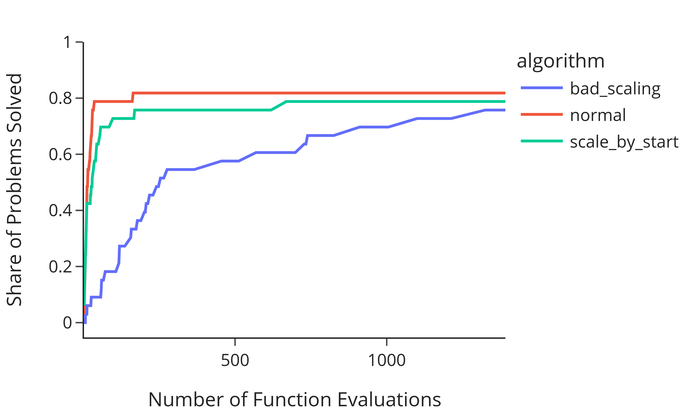
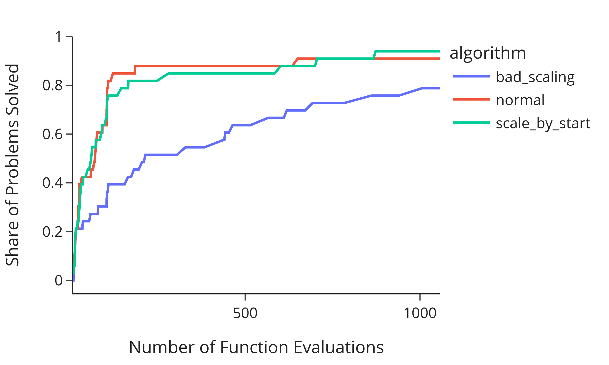

<!-- ===================================================================================
# INSTALLATION SLIDE
==================================================================================== -->
<!-- paginate: false -->


### Installation

We assume you have done the following: Installed [miniconda](https://docs.conda.io/en/latest/miniconda.html) and
```console
git clone https://github.com/OpenSourceEconomics/scipy-estimagic.git
cd scipy-estimagic
conda env create -f environment.yml
conda activate scipy-estimagic
```
- If you haven't done so, please do so until the first practice session
- Details: https://github.com/OpenSourceEconomics/scipy-estimagic

---

<!-- ===================================================================================
# TITLE PAGE
==================================================================================== -->
<!-- paginate: false -->

## Practical Numerical Optimization with Scipy, Estimagic and JAXopt

Scipy Conference 2022

<br/>

#### Janos Gabler & Tim Mensinger

University of Bonn

---

<!-- ===================================================================================
# First hour
==================================================================================== -->


<!-- paginate: true -->

### About Us
<!-- _class: split -->
<div class=leftcol>


- Website: [janosg.com](https://janosg.com)
- GitHub: [janosg](https://github.com/janosg/)
- Started estimagic in 2019
- Just submitted PhD thesis, looking for jobs soon

</div>
<div class=rightcol>


- Website: [tmensinger.com](https://tmensinger.com)
- GitHub: [timmens](https://github.com/timmens)
- estimagic core contributor
- PhD student in Econ, University of Bonn


</div>

---

### Sections

1. Introduction to `scipy.optimize`
2. Introduction to `estimagic`
3. Choosing algorithms
4. Advanced topics
5. Jax and Jaxopt

---

### Structure of each topic

1. Summary of exercise you will solve
2. Some theory
3. Syntax in very simplified example
4. You solve a more difficult example in a notebook
5. Discuss one possible solution

---

<!-- _class: lead -->
# Introduction to scipy.optimize

---
### Preview of practice session

- Translate a criterion function from math to code
  
- Use `scipy.optimize` to minimize the criterion function

---
### Example problem

<!-- _class: split -->
<style scoped>
section.split {
    grid-template-columns: 700px 400px;
}
</style>

<div class=leftcol>

- **Criterion** $f(a, b) = a^2 + b^2$
- Parameters $a$, $b$
- Want: $a^*, b^* = \text{argmin} f(a, b)$
- Possible extensions:
    - Constraints
    - Bounds
- Optimum at $a^*=0$, $b^*=0$, $f(a^*,b^*) = 0$

</div>

<div class=rightcol>


</div>


---

### Solve example problem with scipy.optimize

```python
>>> import numpy as np
>>> from scipy.optimize import minimize

>>> def sphere(x):
        a, b = x
...     return a ** 2 + b ** 2

>>> x0 = np.ones(2)
>>> res = minimize(sphere, x0)
>>> res.fun
0.0
>>> res.x
array([0.0, 0.0])
```
---

### Features of scipy.optimize

- `minimize` as unified interface to 14 local optimizers
    - some support bounds
    - some support constraints
- Parameters are 1d arrays
- Maximize by minimizing $- f(x)$
- Different interfaces for:
    - global optimization
    - nonlinear least-squares

---


<!-- _class: lead -->
# Practice Session 1: First optimization with scipy.optimize (15 min)

---
<!-- _class: split -->
<style scoped>
    section.split {
        grid-template-columns: 550px 550px;
        grid-template-areas:
            "leftpanel rightpanel";
    }

</style>
<div class=leftcol>

#### Pros

- Very mature and reliable
- No additional dependencies
- Low overhead
- Enough algorithms for many use-cases


</div>
<div class=rightcol>

#### Cons

- Relatively few algorithms
- No parallelization
- Maximization via sign flipping
- Feedback only at end
- No feedback in case of crash
- Parameters are flat arrays

</div>

---


### Examples from real projects I

<style scoped>
section code {
  font-size: 20px;
}
</style>

```python
def parse_parameters(x):
    """Parse the parameter vector into quantities we need."""
    num_types = int(len(x[54:]) / 6) + 1
    params = {
        'delta': x[0:1],
        'level': x[1:2],
        'coeffs_common': x[2:4],
        'coeffs_a': x[4:19],
        'coeffs_b': x[19:34],
        'coeffs_edu': x[34:41],
        'coeffs_home': x[41:44],
        'type_shares': x[44:44 + (num_types - 1) * 2],
        'type_shifts': x[44 + (num_types - 1) * 2:]
    }
    return params
```

---

### Examples from real projects II

<style scoped>
section code {
  font-size: 20px;
}
</style>

```python
>>> scipy.optimize.minimize(func, x0)
---------------------------------------------------------------------------
LinAlgError                               Traceback (most recent call last)
<ipython-input-17-7459e5b4d8d4> in <module>
----> 1 scipy.optimize.minimize(func, x0)

     95
     96 def _raise_linalgerror_singular(err, flag):
---> 97     raise LinAlgError("Singular matrix")
     98

LinAlgError: Singular matrix
```
- After 5 hours and with no additional information

---

<!-- _class: lead -->
# Introduction to estimagic

---
### Preview of practice session

- Translate a `scipy` optimization to `estimagic.minimize`
- Use dictionaries instead of flat arrays as parameters in the optimization
- Plot the optimization history (criterion and parameter)

---
### What is estimagic?

- Library for numerical optimization
- Tools for nonlinear estimation and inference
- Harmonized interface to:
    - Scipy, Nlopt, TAO, Pygmo, ...
- Adds functionality and convenience

---

### You can use it like scipy
<!-- _class: split -->
<style scoped>
section.split {
    grid-template-columns: 650px 450px;
}
</style>

<div class=leftcol>

```python
>>> import estimagic as em
>>> def sphere(x):
       a, b = x
...    return a ** 2 + b ** 2

>>> res = em.minimize(
...     criterion=sphere,
...     params=np.ones(2),
...     algorithm="scipy_lbfgsb",
... )

>>> res.params
array([ 0., 0])
```
</div>
<div class=rightcol>

- No default algorithm
- Options have different names

</div>

---


### Params can be (almost) anything

<!-- _class: split -->
<style scoped>
section.split {
    grid-template-columns: 620px 480px;
}
</style>

<div class=leftcol>

```python
>>> params = {"a": 0, "b": 1, "c": pd.Series([2, 3, 4])}
>>> def dict_sphere(x):
...     out = (
...         x["a"] ** 2 + x["b"] ** 2 + (x["c"] ** 2).sum()
...     )
...     return out

>>> res = em.minimize(
...     criterion=dict_sphere,
...     params=params,
...     algorithm="scipy_neldermead",
... )

>>> res.params
{'a': 0.,
 'b': 0.,
 'c': 0    0.
      1    0.
      2    0.
 dtype: float64}
```
</div>
<div class=rightcol>

- numpy arrays
- pd.Series, pd.DataFrame
- scalars
- (Nested) lists, dicts and tuples thereof
- Special case: DataFrame with columns `"value"`, `"lower_bound"` and `"upper_bound"`
</div>


---

### OptimizeResult

```
>>> res
Minimize with 5 free parameters terminated successfully after 805 criterion evaluations and 507 iterations.

The value of criterion improved from 30.0 to 1.6760003634613059e-16.

The scipy_neldermead algorithm reported: Optimization terminated successfully.

Independent of the convergence criteria used by scipy_neldermead, the strength of convergence can be
assessed by the following criteria:
                             one_step     five_steps
relative_criterion_change  1.968e-15***  2.746e-15***
relative_params_change     9.834e-08*    1.525e-07*
absolute_criterion_change  1.968e-16***  2.746e-16***
absolute_params_change     9.834e-09**   1.525e-08*

(***: change <= 1e-10, **: change <= 1e-8, *: change <= 1e-5. Change refers to a change between accepted
steps. The first column only considers the last step. The second column considers the last five steps.)
```

---

### Access OptimizeResult's attributes

```python
>>> res.criterion
.0
>>> res.n_criterion_evaluations
805
>>> res.success
True
>>> res.message
'Optimization terminated successfully.'
>>> res.history.keys():
dict_keys(['params', 'criterion', 'runtime'])
```

---

<!-- _class: split -->
<style scoped>
section.split {
    grid-template-columns: 500px 600px;
}
</style>


### Logging and Dashboard

<div class=leftcol>

```python
>>> res = em.minimize(
...    criterion=sphere,
...    params=np.arange(5),
...    algorithm="scipy_lbfgsb",
...    logging="my_log.db",
... )

>>> from estimagic import OptimizeLogReader

>>> reader = OptimizeLogReader("my_log.db")
>>> reader.read_history().keys()
dict_keys(['params', 'criterion', 'runtime'])

>>> reader.read_iteration(1)["params"]
array([0., 0.817, 1.635, 2.452, 3.27 ])
```

</div>

<div class=rightcol>

- Persistent log in sqlite database
- No data loss ever
- Can be read during optimization
- Provides data for dashboard
- No SQL knowledge needed

</div>


---

<!-- _class: split -->

### Criterion plot

<div class=leftcol>

```python
em.criterion_plot(res)
```

</p>

</div>
<div class=rightcol>

- First argument can be:
    - `OptimizeResult`
    - path to log file
    - list or dict thereof
- Dictionary keys are used for legend

</div>

---

<!-- _class: split -->

### Criterion plot (2)

<div class=leftcol>

```python
em.criterion_plot(res, monotone=True)
```

</p>

</div>
<div class=rightcol>

- `monotone=True` shows the current best value
- useful if there are extreme values in history

</div>

---

<!-- _class: split -->

### Criterion plot (3)

<div class=leftcol>

```python
em.criterion_plot(res, max_evaluations=300)
```

</p>

</div>
<div class=rightcol>

- `max_evaluations` sets upper limit of x-axis

</div>

---
<!-- _class: split -->

### Params plot

<style scoped>
section.split {
    grid-template-columns: 450px 650px;
}
</style>

<div class=leftcol>


```python
# reminder: params looks like this
params = {
    "a": 0,
    "b": 1,
    "c": pd.Series([2, 3, 4])
}

em.params_plot(
    res,
    max_evaluations=300,
)
```

</div>
<div class=rightcol>


- Similar options as `criterion_plot`

</div>

---
<!-- _class: split -->

### Params plot (2)

<style scoped>
section.split {
    grid-template-columns: 450px 650px;
}
</style>

<div class=leftcol>


```python
em.params_plot(
    res,
    max_evaluations=300,
    selector=lambda x: x["c"],
)
```

</div>
<div class=rightcol>


- `selector` is a function returning a subset of params

</div>

---

### There is maximize

```python
>>> def upside_down_sphere(params):
...     return -params @ params

>>> res = em.maximize(
...     criterion=upside_down_sphere,
...     params=np.arange(5),
...     algorithm="scipy_lbfgs",
... )
>>> res.params
array([ 0.,  0.,  0.,  0., 0.])
```

---

<!-- _class: split -->

### Harmonized algo_options

<style scoped>
section.split {
    grid-template-columns: 600px 500px;
}
</style>

<div class=leftcol>

```python
>>> algo_options = {
...     "convergence.relative_criterion_tolerance": 1e-9,
...     "stopping.max_iterations": 100_000,
...     "trustregion.initial_radius": 10.0,
... }

>>> res = em.minimize(
...     criterion=sphere,
...     params=np.arange(5),
...     algorithm="nag_pybobyqa",
...     algo_options=algo_options,
... )
>>> res.params
array([0., 0., 0., 0., 0.])
```

</div>

<div class=rightcol>

- The same options have the same name
- Different options have different names
    - e.g., not one `tol`
- Ignore irrelevant options

</div>


---

<!-- _class: split -->

### [estimagic.readthedocs.io](https://estimagic.readthedocs.io/en/stable/index.html)


---


<!-- ===================================================================================
# Second hour
==================================================================================== -->
<!-- _class: lead -->
# Break (5 min)

---


<!-- _class: lead -->
# Practice Session 2: Convert previous example to estimagic (15 min)

---

<!-- _class: lead -->
# Choosing algorithms

---
### Preview of practice session

You will get optimization problems that fail

- Figure out why they fail
- Choose an algorithm that works

---

### Relevant problem properties

- **Smoothness**: Differentiable? Kinks? Discontinuities? Stochastic?
- **Convexity**: Are there local optima?
- **Goal**: Do you need a global solution? How precise?
- **Size**: 2 parameters? 10? 100? 1000? More?
- **Constraints**: Bounds? Linear constraints? Nonlinear constraints?
- **Structure**: Nonlinear least-squares, Log-likelihood function

-> Properties guide selection but experimentation is important

---

### `scipy_lbfgsb`

- Limited memory BFGS
- BFGS: Approximate hessians from multiple gradients
- Criterion must be differentiable
- Scales to a few thousand parameters
- Beats other BFGS implementations in many benchmarks
- Low overhead

---

### `fides`

- Derivative based trust-region algorithm
- Developed by Fabian Fröhlich as a Python package
- Many advanced options to customize the optimization!
- Criterion must be differentiable
- Good solution if `scipy_lbfgsb` is too aggressive

---

### `nlopt_bobyqa`, `nag_pybobyqa`

- **B**ound **O**ptimization **by** **Q**uadratic **A**pproximation
- Derivative free trust region algorithm
- `nlopt` has less overhead
- `nag` has options to deal with noise
- Good for non-differentiable not too noisy functions
- Slower than derivative based methods but faster than neldermead

---

### `scipy_neldermead`, `nlopt_neldermead`

- Popular direct search method
- `scipy` does not support bounds
- `nlopt` requires fewer criterion evaluations in most benchmarks
- Almost never the best choice but sometimes not the worst

---

### `scipy_ls_lm`, `scipy_ls_trf`

- Derivative based optimizers for nonlinear least squares
- Criterion needs structure: $F(x) = \sum_i f_i(x)^2$
- In estimagic, criterion returns a dict:

```python
def sphere_ls(x):
    # x are the least squares residuals in the sphere function
    return {"root_contributions": x, "value": x @ x}
```
- `scipy_ls_lm` is better for small problems without bounds
- `scipy_ls_trf` is better for problems with many parameters

---

### `nag_dfols`, `pounders`

- Derivative free trust region method for nonlinear least-squares
- Both beat bobyqa for least-squares problems!
- `nag_dfols` is usually the fastest
- `nag_dfols` has advanced options to deal with noise
- `pounders` can do criterion evaluations in parallel

---

### `ipopt`

- Probably best open source optimizer for nonlinear constraints

---
<!-- _class: lead -->
# Practice Session 3: Play with `algorithm` and `algo_options` (20 min)

---
<!-- _class: lead -->
# Benchmarking

---
### Preview of practice session

- Compare different optimizers on benchmark sets
- Visualize comparison using profile and convergence plots

---
### What is benchmarking

- Compare algorithms on functions with known optimum
- Mirror problems you actually want to solve
    - similar number of parameters
    - similar w.r.t. differentiability or noise
- Benchmark functions should be fast!

---

### Running benchmarks in estimagic

<!-- _class: split -->
<style scoped>
section.split {
    grid-template-columns: 450px 650px;
}
</style>


<div class=leftcol>

```python
problems = em.get_benchmark_problems(
    "estimagic",
)
optimizers = [
    "scipy_lbfgsb",
    "nag_dfols",
    "nlopt_bobyqa",
    "scipy_neldermead",
]
results = em.run_benchmark(
    problems=problems,
    optimize_options=optimizers,
    n_cores=4,
    max_criterion_evaluations=1000,
)
```

</div>
<div class=rightcol>

1. Create a set of test problems:
    - dict with functions, start values and correct solutions
2. Define `optimize_options`
    - Optimizers to try
    - Optionally: keyword arguments for minimize
3. Get benchmark results
    - Dict with histories and solutions

</div>

---
### Profile plots

```python
em.profile_plot(problems, results)
```


---

### Convergence plots


<!-- _class: split -->
<style scoped>
section.split {
    grid-template-columns: 300px 800px;
}
</style>


<div class=leftcol>

```python
subset = [
    "chebyquad_10",
    "chnrsbne",
    "penalty_1",
    "bdqrtic_8",
]
em.convergence_plot(
    problems,
    results,
    problem_subset=subset,
)
```

</div>
<div class=rightcol>


</div>


---

### Why not look at runtime

- Benchmark functions are very fast (microseconds)
    -> Runtime dominated by algorithm overhead
- Most real functions are slow (milliseconds, seconds, minutes, ...)
    -> Runtime dominated by the number of evaluations

- You can do runtime plots as well


---


<!-- _class: lead -->
# Practice Session 4: Benchmarking optimizers (15 min)

---


<!-- _class: lead -->
# Break (10 min)

<!-- ===================================================================================
# Third hour
==================================================================================== -->

---

<!-- _class: lead -->
# Bounds and Constraints
--- 

### Preview of practice session

- Solve optimization problem with
    - parameter bounds
    - fixed parameters
    - linear constraints

---

### Bounds

- Lower and upper bounds on parameters
- Also called box constraints
- Handled by most algorithms
- Need to hold for start parameters
- Guaranteed to hold during entire optimization
- Specification depends on `params` format

---

### How to specify bounds for array params

<!-- _class: split -->
<style scoped>
section.split {
    grid-template-columns: 650px 450px;

}
</style>

<div class=leftcol>


```python
>>> def sphere(x):
...     return x @ x

>>> res = em.minimize(
...     criterion=sphere,
...     params=np.arange(3) + 1,
...     lower_bounds=np.ones(3),
...     algorithm="scipy_lbfgsb",
... )
>>> res.params
array([1., 1., 1.])
```
</div>
<div class=rightcol>

- Specify `lower_bounds` and `upper_bounds`
- Use `np.inf` or `-np.inf` to represent no bounds

</div>

---

### How to specify bounds for DataFrame params

```python
>>> params = pd.DataFrame({
...         "value": [1, 2, 3],
...         "lower_bound": [1, 1, 1],
...         "upper_bound": [3, 3, 3],
...     },
...     index=["a", "b", "c"],
... )

>>> def criterion(p):
...     return (p["value"] ** 2).sum()

>>> em.minimize(criterion, params, algorithm="scipy_lbfgsb")
```

---

### How to specify bounds for pytree params

<!-- _class: split -->
<style scoped>
section.split {
    grid-template-columns: 650px 450px;

}
</style>

<div class=leftcol>


```python
params = {"x": np.arange(3), "intercept": 3}

def criterion(p):
    return p["x"] @ p["x"] + p["intercept"]

res = em.minimize(
    criterion,
    params=params,
    algorithm="scipy_lbfgsb",
    lower_bounds={"intercept": -2},
)

```

</div>
<div class=rightcol>

- Enough to specify the subset of params that actually has bounds
- We try to match your bounds with params
- Raise `InvalidBoundsError` in case of ambiguity

</div>


---

### Constraints


- Constraints are conditions on parameters
- Linear constraints
    - $\min_{x} f(x) s.t. l \leq A x \leq u$
    - $\min_{x} f(x) s.t. A x = v$
- Nonlinear constraints:
    - $\min_{x} f(x)$ s.t. $c_1(x) = 0, c_2(x) >= 0$
- "estimagic-constraints":
    - E.g. find probabilities or covariance matrix, fix parameters, ...

---


### Example: Find valid probabilities

<!-- _class: split -->

<style scoped>
section.split {
    grid-template-columns: 550px 550px;
}
</style>
<div class=leftcol>

```python
>>> res = em.minimize(
...     criterion=sphere,
...     params=np.array([0.1, 0.5, 0.4, 4, 5]),
...     algorithm="scipy_lbfgsb",
...     constraints=[{
...         "loc": [0, 1, 2],
...         "type": "probability"
...     }],
... )

>>> res.params
array([0.33334, 0.33333, 0.33333, -0., 0.])
```
</div>
<div class=rightcol>

- Restrict first 3 parameters to be probabilities
    - Between 0 and 1
    - Sum to 1
- But "scipy_lbfsb" is unconstrained?!

</div>

---

### What happened

- Estimagic can implement some types of constraints via reparametrization
- Transforms a constrained problem into an unconstrained one
- Constraints must hold in start params
- Guaranteed to hold during entire optimization

---

### Which constraints can be handled via reparametrization?

- Fixing parameters (simple but useful)
- Finding valid covariance and correlation matrices
- Finding valid probabilities
- Linear constraints (as long as there are not too many)
    - $\min f(x) \, s.t. \, A_1 x = 0 \text{ and } A_2 x \leq 0$

---

### Fixing parameters

<!-- _class: split -->
<style scoped>
section.split {
    grid-template-columns: 650px 450px;
}
</style>


<div class=leftcol>

```python
>>> def criterion(params):
...     offset = np.linspace(1, 0, len(params))
...     x = params - offset
...     return x @ x

unconstrained_optimum = [1, 0.8, 0.6, 0.4, 0.2, 0]

>>> res = em.minimize(
...     criterion=criterion,
...     params=np.array([2.5, 1, 1, 1, 1, -2.5]),
...     algorithm="scipy_lbfgsb",
...     constraints={"loc": [0, 5], "type": "fixed"},
... )
>>> res.params
array([ 2.5,  0.8,  0.6,  0.4,  0.2, -2.5])
```

</div>
<div class=rightcol>

- `loc` selects location 0 and 5 of the parameters
- `type` states that they are fixed

</div>


---

### Linear constraints

<!-- _class: split -->
<style scoped>
section.split {
    grid-template-columns: 550px 550px;
}
</style>


<div class=leftcol>

```python
>>> res = em.minimize(
...     criterion=criterion,
...     params=np.ones(6),
...     algorithm="scipy_lbfgsb",
...     constraints={
...         "loc": [0, 1, 2, 3],
...         "type": "linear",
...         "lower_bound": 0.95,
...         "weights": 0.25,
...     },
... )
>>> res.params
array([ 1.25, 1.05, 0.85, 0.65, 0.2 , -0.])
```

</div>
<div class=rightcol>

- Impose that average of first 4 parameters is larger than 0.95
- Weights can be scalars or same length as selected parameters
- Use "value" instead of "lower_bound" for linear equality constraint

</div>

---

### Constraints have to hold

```python
>>> em.minimize(
...     criterion=sphere,
...     params=np.array([1, 2, 3, 4, 5]),
...     algorithm="scipy_lbfgsb",
...     constraints={"loc": [0, 1, 2], "type": "probability"},
... )
```
```
InvalidParamsError: A constraint of type 'probability' is not fulfilled in params,
please make sure that it holds for the starting values. The problem arose because:
Probabilities do not sum to 1. The names of the involved parameters are: ['0', '1', '2']
The relevant constraint is:
{'loc': [0, 1, 2], 'type': 'probability', 'index': array([0, 1, 2])}.
```

---


### Nonlinear constraints
<!-- _class: split -->
<style scoped>
section.split {
    grid-template-columns: 500px 600px;
}
</style>


<div class=leftcol>

```python
>>> res = em.minimize(
...     criterion=criterion,
...     params=np.ones(6),
...     algorithm="scipy_slsqp",
...     constraints={
...         "type": "nonlinear",
...         "loc": [0, 1, 2, 3, 4],
...         "func": lambda x: np.prod(x),
...         "value": 1.0,
...     },
... )
>>> res.params
array([1.31, 1.16, 1.01, 0.87, 0.75, -0.])
```

</div>
<div class=rightcol>

- Restrict the product of first five parameters to 1
- Only work with some optimizers
- `func` can be an arbitrary python function of params that returns a number, array or pytree
- Use "lower_bound" and "upper_bound" instead of "value" for inequality constraints

</div>

---

### Parameter selection methods

- `"loc"` can be replaced other things
- If params is a DataFrame with "value" column
    - `"query"`: An arbitrary query string that selects the relevant rows
    - `"loc"`: Will be passed to `DataFrame.loc`
- Always
    - `"selector"`: A function that takes params as argument and returns a subset of params
- More in the [documentation](https://estimagic.readthedocs.io/en/stable/how_to_guides/optimization/how_to_specify_constraints.html#how-to-select-the-parameters)
---


<!-- _class: lead -->
# Practice Session 5: Constrained optimization (15 min)


---

<!-- _class: lead -->
# Global optimization

---


### Global vs local optimization

- Local: Find any local optimum
    - All we have done so far
- Global: Find best local optimum
    - Needs bounds to be well defined
    - Extremely challenging in high dimensions
- Local = global for convex problems

---

### Examples

<!-- _class: split -->
<style scoped>
section.split {
    grid-template-columns: 550px 550px;
}
</style>


<div class=leftcol>


</div>
<div class=rightcol>


</div>


---

### How about brute force?
<!-- _class: split -->
<style scoped>
section.split {
    grid-template-columns: 400px 700px;
}
</style>


<div class=leftcol>


</div>
<div class=rightcol>

<style scoped>
table {
  font-size: 30px;
}
</style>


| Number of <br /> Dimensions | Runtime (1 ms per evaluation, <br /> 100 points per dimension) |
| ----------------------------| ---------------------------------------------------------------|
| 1                           | 100 ms                                                         |
| 2                           | 10 s                                                           |
| 3                           | 16 min                                                         |
| 4                           | 27 hours                                                       |
| 5                           | 16 weeks                                                       |
| 6                           | 30 years                                                       |

</div>


---

### Genetic algorithms

- Heuristic inspired by natural selection
- Random initial population of parameters
- In each evolution step:
    - Evaluate "fitness" of all population members
    - Replace worst by combinations of good ones
- Converge when max iterations are reached
- Examples: `"pygmo_gaco"`, `"pygmo_bee_colony"`, `"nlopt_crs2_lm"`, ...

---

### Bayesian optimization

- Evaluate criterion on grid or sample of parameters
- Build surrogate model of criterion
- In each iteration
    - Do new criterion evaluations at promising points
    - Improve surrogate model
- Converge when max iterations is reached

---

### Multistart optimization:

- Evaluate criterion on random exploration sample
- Run local optimization from best point
- In each iteration:
    - Combine best parameter and next best exploration point
    - Run local optimization from there
- Converge if current best optimum is rediscovered several times

---

<!-- _class: split -->

### Multistart example
<div class=leftcol>


```python
>>> res = em.minimize(
...     criterion=sphere,
...     params=np.arange(5),
...     algorithm="scipy_neldermead",
...     soft_lower_bounds=np.full(5, -5),
...     soft_upper_bounds=np.full(5, 15),
...     multistart=True,
...     multistart_options={
...         "convergence.max_discoveries": 5,
...         "n_samples": 1000
...     },
... )
>>> res.params
array([0., 0., 0., 0.,  0.])
```


</div>
<div class=rightcol>

- Turn local optimizers global
- Inspired by [tiktak algorithm](https://github.com/serdarozkan/TikTak#tiktak)
- Use any optimizer
- Distinguish hard and soft bounds

</div>

---

### How to choose

- Extremely expensive criterion (i.e. can only do a few evaluations):
    - Bayesian optimization
- Well behaved function:
    - Multistart with local optimizer tailored to function properties
- Rugged function with extremely many local optima
    - Genetic optimizer
    - Consider refining the result with local optimizer
- All are equally parallelizable

---


<!-- _class: lead -->
# Scaling

---
### Preview of practice session

- Learn about badly scaled problems
- Visualize sensitiviy of criterion w.r.t parameters
- Use scaling to improve an optimization

---

### What is scaling

- Single most underrated topic among economists!
- Well scaled: A fixed step in any parameter dimension yields roughly comparable changes in function value
    - $f(a, b) = 0.5 a^2 + 0.8 b^2$
- Badly scaled: Some parameters are much more influential
    - $f(a, b) = 1000 a^2 + 0.2 b^2$
- Often arises when parameters have very different units

---

### Effects of bad scaling

- Will try performance of optimizers on
    - Standard "estimagic" set of problems
    - badly scaled version
    - badly scaled version when `scaling=True` in `minimize`

```python
problems_bad_scaling = get_benchmark_problems(
    name="estimagic",
    scaling=True,
    scaling_options={"min_scale": 1, "max_scale": 1_000},
)
```

---


### Effect of bad scaling: `scipy_lbfgsb`



---

### Effect of bad scaling: `nag_dfols`



---

### Effect of bad scaling: `nlopt_bobyqa`


---

### Scaling in estimagic: By start params

<!-- _class: split -->
<style scoped>
section.split {
    grid-template-columns: 550px 550px;
}
</style>


<div class=leftcol>

```python
def badly_scaled(x):
    out = (
        0.01 * np.abs(x[0])
        + np.abs(x[1])
        + (x[2] - 0.9) ** 6
    )
    return out

em.minimize(
    criterion=badly_scaled,
    params=np.array([200, 1, 1]),
    scaling=True,
)
```

</div>
<div class=rightcol>

- Optimizer sees x / x_start
- Will recover that x[0] needs large steps
- Won't recover that x[2] needs tiny steps

</div>

---


### Scaling in estimagic: By bounds

<!-- _class: split -->
<style scoped>
section.split {
    grid-template-columns: 550px 550px;
}
</style>


<div class=leftcol>

```python

em.minimize(
    criterion=badly_scaled,
    params=np.array([200, 1, 1]),
    scaling=True,
    lower_bounds=np.array([-200, -2, 0.8]),
    upper_bounds=np.array([600, 2, 1]),
    scaling=True,
    scaling_options={"method": "bounds"},
)

```

</div>
<div class=rightcol>

- Internal parameter space mapped to $[0, 1]^n$
- Will work great in this case
- Requires careful specification of bounds

</div>

---

<!-- _class: split -->
<style scoped>
section.split {
    grid-template-columns: 550px 550px;
    grid-template-areas:
        "leftpanel rightpanel";
}
</style>


<div class=leftcol>

#### Very scale sensitive

- `nag_pybobyqa`
- `tao_pounders`
- `pounders`
- `nag_dfols`
- `scipy_cobyla`

#### Somewhat scale sensitive

- `scipy_lbfgsb`
- `fides`

</div>
<div class=rightcol>


#### Not scale sensitive

- `scipy_neldermead`
- `nlopt_neldermead`
- `nlopt_bobyqa`
- `scipy_powell`
- `scipy_ls_lm`
- `scipy_ls_trf`

</div>


---
<!-- _class: lead -->
# Practice Session 6: Scaling of optimization problems (15 min)


<!-- ===================================================================================
# Last hour
==================================================================================== -->

---
<!-- _class: lead -->
# JAX and JAXopt

--- 
### Preview of practice session(s)

- Solve an optimization problem using JAX gradients
- Solve an optimization problem using JAXopt
- Write a batched solver using JAXopt

---

#### Numerical vs automatic differentiation (oversimplified)

- **Automatic differentiation**
    - Magic way to calculate precise derivatives of Python functions
    - Gradient calculation takes 3 to 4 times longer than function
    - Runtime is independent of number of parameters
    - Code must be written in a certain way
- **Numerical differentiation**
    - Finite step approximation to derivatives
    - Less precise than automatic differentiation
    - Runtime increases linearly with number of parameters


---
### What is JAX

- GPU accelerated replacement for Numpy
- State of the art automatic differentiation
    - Gradients
    - Jacobians
    - Hessians
- Just in time compiler for python code
- Composable function transformations such as `vmap`

---

### Calculating derivatives with JAX

```python
>>> import jax.numpy as jnp
>>> import jax

>>> def sphere(x):
...     return jnp.sum(x ** 2)

>>> gradient = jax.grad(sphere)

>>> gradient(jnp.array([1., 1.5, 2.]))
DeviceArray([2., 3., 4.], dtype=float64)
```

---

### Providing derivatives to estimagic

<!-- _class: split -->
<div class=leftcol>

```python
>>> def sphere_gradient(params):
...     return 2 * params

>>> em.minimize(
...     criterion=sphere,
...     params=np.arange(5),
...     algorithm="scipy_lbfgsb",
...     derivative=sphere_gradient,
... )

>>> em.minimize(
...     criterion=sphere,
...     params=np.arange(5),
...     algorithm="scipy_lbfgsb",
...     numdiff_options={"n_cores": 6},
... )
```

</div>

<div class=rightcol>

- You can provide derivatives
- Otherwise, estimagic calculates them numerically
- Parallelization on (up to) as many cores as parameters

</div>


---

<!-- _class: lead -->
# Practice Session 7: Using JAX derivatives in estimagic (10 min)


---
<!-- _class: split -->
<style scoped>
section.split {
    grid-template-columns: 600px 500px;
    grid-template-areas:
        "leftpanel rightpanel";
}
</style>
<div class=leftcol>

#### What is JAXopt

- Library of optimizers written in JAX

- Hardware accelerated

- Batchable

- Differentiable


</div>
<div class=rightcol>

#### When to use it

- Solve many instances of same optimization problem
- Differentiate optimization w.r.t hyperparameters

</div>


---
### Example

Economic problem:

- Many agents facing similar optimization problem
    - batchable
- Gradient of log-likelihood requires gradient of solutions
    - differentiable solutions


---

### Simple optimization in JAXopt
<!-- _class: split -->
<div class=leftcol>

```python
>>> import jax
>>> import jax.numpy as jnp
>>> from jaxopt import LBFGS

>>> x0 = jnp.array([1.0, -2, -5])
>>> shift = jnp.array([-2.0, -4, -6])

>>> def criterion(x, shift):
...     return jnp.vdot(x, x + shift)

>>> solver = LBFGS(fun=criterion)

>>> result = solver.run(init_params=x0, shift=shift)
>>> result.params
DeviceArray([1.0, 2.0, 3.0], dtype=float64)
```

</div>
<div class=rightcol>

<br>

- import solver

- initialize solver with criterion

- run solver with starting parameters

- pass additional arguments of criterion to run method

</div>


---

<!-- _class: split -->
### Vmap

<div class=leftcol>

```python
>>> import numpy as np
>>> import scipy as sp

>>> a = np.stack([np.diag([1, 2]), np.diag([3, 4])])
>>> a[0]
array([[ 1. , 0.],
       [ 0. , 2.]])

>>> sp.linalg.inv(a[0])
array([[ 1. , -0. ],
       [ 0. ,  0.5]])

>>> sp.linalg.inv(a)
... ValueError: expected square matrix

>>> res = [sp.linalg.inv(a[i]) for i in [0, 1]]
>>> np.stack(res)
array([[[ 1.        , -0.        ],
        [ 0.        ,  0.5       ]],
       [[ 0.33333333, -0.        ],
        [ 0.        ,  0.25      ]]])
```
</div>
<div class=rightcol>

- consider matrix inversion

- not defined for arrays with dimension > 2 (in `scipy`)

- loop over 2d matrices

- syntactic sugar: `np.vectorize` and the like

    - does not increase speed


</div>


---

<!-- _class: split -->
### Vmap in JAX

<div class=leftcol>

```python
>>> import jax.numpy as jnp
>>> import jax.scipy as jsp
>>> from jax import vmap, jit

>>> a = jnp.array(a)

>>> jax_inv = jit(vmap(jsp.linalg.inv))

>>> jax_inv(a)
DeviceArray([[[1.        , 0.        ],
              [0.        , 0.5       ]],

             [[0.33333333, 0.        ],
              [0.        , 0.25      ]]], dtype=float64)
```
</div>
<div class=rightcol>

- use `jax.numpy` and `jax.scipy`

- define vectorized map using `jax.vmap`

- need `jit` on the outside to compile the new function


</div>

---

<!-- _class: split -->
### Vectorize an optimization in JAXopt

<div class=leftcol>

```python
>>> from jax import jit, vmap

>>> def solve(x, shift):
...     return solver.run(init_params=x, shift=shift).params

>>> batch_solve = jit(vmap(solve, in_axes=(None, 0)))
>>> shifts = jnp.array([
        [0.0, 1.0, 2.0],
        [3.0, 4.0, 5.0]
    ])

>>> batch_solve(x0, shifts)
DeviceArray([[ 0. , -0.5, -1. ],
             [-1.5, -2. , -2.5]], dtype=float64)
```
</div>
<div class=rightcol>

- import `jit` and `vmap`

- define wrapper around solve

- call vmap on wrapper

    - `in_axes=(None, 0)` means that we map over the 0-axis of the second argument

    - call `jit` at the end

</div>

---

<!-- _class: split -->
### Differentiate a solution in JAXopt

<div class=leftcol>

```python
>>> from jax import jacobian

>>> jacobian(solve, argnums=1)(x0, weight)
DeviceArray([[-0.5,  0. ,  0. ],
             [ 0. , -0.5,  0. ],
             [ 0. ,  0. , -0.5]], dtype=float64)

```
</div>
<div class=rightcol>

<br>

- import `jacobian` or `grad`

- use `argnums` to specify w.r.t. which argument we differentiate

</div>

---

<!-- _class: lead -->
# Practice Session 8: Vectorized optimization in JAXopt (15 min)

---

<!-- _class: lead -->
# Final remarks

---


### Tips

- Exploit least squares structure if you can
- Look at criterion and params plots
- Try multiple algorithms (based on theory) and take the best (based on experiments)
- Think about scaling
- Use multistart over genetic algorithms for well behaved functions
- Make your problem jax compatible and use automatic differentiation


---

### The estimagic Team


<style scoped>
.center {
  margin-left: auto;
  margin-right: auto;
  font-size: 24px;
}

</style>


<table class="center">
    <tr>
        <th>
            
            <br>
            Janos
        </th>
        <th>
            
            <br>
            Tim
        </th>
        <th>
            
            <br>
            Klara
        </th>
    </tr>
    <tr>
        <th>
            
            <br>
            Sebastian
        </th>
        <th>
            
            <br>
            Tobias
        </th>
        <th>
            
            <br>
            Hans-Martin
        </th>
    </tr>
</table>


---

### How to contribute

- Make issues or provide feedback
- Improve or extend the documentation
- Suggest, wrap or implement new optimizers
- Teach estimagic to colleagues, students and friends
- Make us happy by giving us a :star: on [github.com/OpenSourceEconomics/estimagic](https://github.com/OpenSourceEconomics/estimagic)
